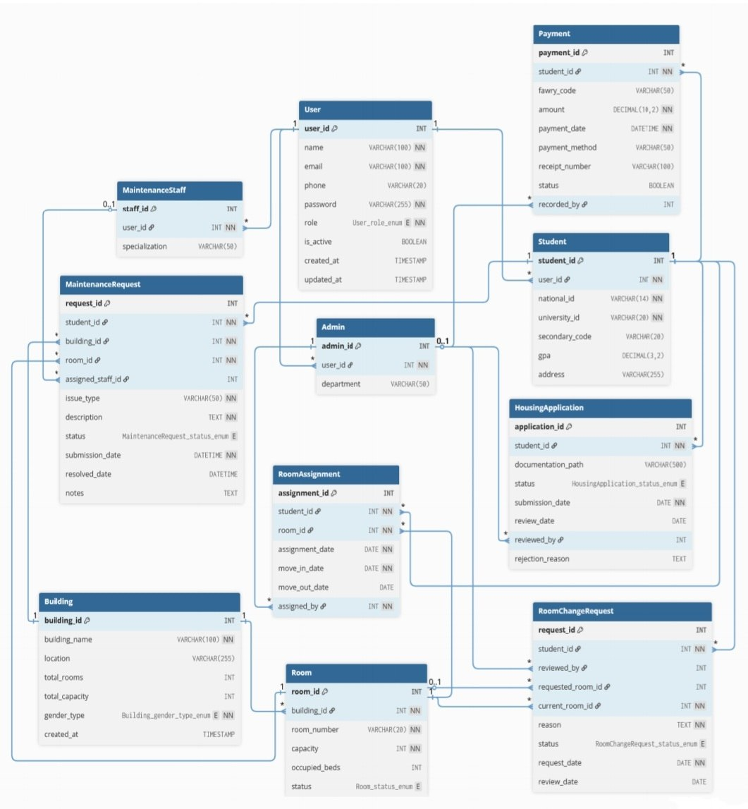

# 🏠 University Housing Management System

A **Spring Boot 4** backend that models the full university housing lifecycle — from student applications and room assignments to maintenance requests and staff management. Business rules are enforced explicitly in the service layer, with guarded state transitions and domain-focused error handling throughout.

---

## Table of Contents

- [Architecture](#architecture)
- [Project Structure](#project-structure)
- [Domain Model](#domain-model)
- [Enums & Status Flows](#enums--status-flows)
- [Business Logic](#business-logic)
- [Exception Handling](#exception-handling)
- [Tech Stack](#tech-stack)
- [API Endpoints](#api-endpoints)
- [Getting Started](#getting-started)
- [Current Limitations](#current-limitations)

---

## Architecture

```
Controller  →  Request DTO  →  Service  →  Repository  →  Entity
                                  ↓
                           Response DTO  ←  MapStruct Mapper
```

| Layer | Package | Responsibility |
|---|---|---|
| API | `controllers/` | REST endpoints, request DTO validation |
| Service | `services/` | Business rules, workflow orchestration |
| Persistence | `Repository/` | Spring Data JPA repositories |
| Mapping | `mapping/` | MapStruct entity ↔ DTO conversion |
| Domain | `entity/`, `enums/` | JPA entities and domain enumerations |
| Exceptions | `exceptions/` | Custom exceptions + `@ControllerAdvice` handler |

---

## Project Structure

```
src/main/java/com/university/
│
├── UniversityHousingManagementSystemApplication.java
│
├── controllers/
│   ├── AdminController.java
│   ├── BuildingController.java
│   ├── HousingApplicationController.java
│   ├── MaintenanceRequestController.java
│   ├── MaintenanceStaffController.java
│   ├── RoomAssignmentController.java
│   ├── RoomChangeRequestController.java
│   ├── RoomController.java
│   ├── StudentController.java
│   └── UserController.java
│
├── services/
│   ├── AdminService.java
│   ├── AuthService.java              ← stub, ready for Security integration
│   ├── BuildingService.java
│   ├── HousingApplicationService.java
│   ├── MaintenanceRequestService.java
│   ├── MaintenanceStaffService.java
│   ├── RoomAssignmentService.java
│   ├── RoomChangeRequestService.java
│   ├── RoomService.java
│   ├── StudentService.java
│   └── UserService.java
│
├── Repository/
│   ├── AdminRepository.java
│   ├── BuildingRepository.java
│   ├── HousingApplicationRepository.java
│   ├── MaintenanceRequestRepository.java
│   ├── MaintenanceStaffRepository.java
│   ├── RoomAssignmentRepository.java
│   ├── RoomChangeRequestRepository.java
│   ├── RoomRepository.java
│   ├── StudentRepository.java
│   └── UserRepository.java
│
├── entity/
│   ├── User.java                     ← base entity (JOINED inheritance)
│   ├── Student.java
│   ├── Admin.java
│   ├── MaintenanceStaff.java
│   ├── Building.java
│   ├── Room.java
│   ├── HousingApplication.java
│   ├── RoomAssignment.java
│   ├── RoomChangeRequest.java
│   └── MaintenanceRequest.java
│
├── dtos/
│   ├── request/
│   │   ├── BuildingRequestDto.java
│   │   ├── RoomRequestDto.java
│   │   ├── HousingApplicationRequestCreateDto.java
│   │   ├── HousingApplicationRequestReviewDto.java
│   │   ├── RoomAssignmentCreateDto.java
│   │   ├── RoomAssignmentUpdateDto.java
│   │   ├── RoomChangeRequestCreateDto.java
│   │   ├── RoomChangeRequestUpdateDto.java
│   │   ├── MaintenanceRequestCreateDto.java
│   │   └── MaintenanceRequestUpdateDto.java
│   └── response/
│       ├── AdminDto.java
│       ├── BuildingResponseDto.java
│       ├── RoomResponseDto.java
│       ├── StudentDto.java
│       ├── UserDto.java
│       ├── MaintenanceStaffDto.java
│       ├── HousingApplicationResponseDto.java
│       ├── RoomAssignmentResponseDto.java
│       ├── RoomChangeResponseDto.java
│       └── MaintenanceResponseDto.java
│
├── mapping/
│   ├── AdminMapper.java
│   ├── BuildingMapper.java
│   ├── RoomMapper.java
│   ├── StudentMapper.java
│   ├── UserMapper.java
│   ├── MaintenanceStaffMapper.java
│   ├── HousingApplicationMapper.java
│   ├── RoomAssignmentMapper.java
│   ├── RoomChangeRequestMapper.java
│   └── MaintenanceRequestMapper.java
│
├── enums/
│   ├── UserType.java
│   ├── BuildingGenderType.java
│   ├── RoomStatus.java
│   ├── HousingApplicationStatus.java
│   ├── RoomChangeStatus.java
│   ├── MaintenanceStatus.java
│   └── PaymentStatus.java
│
└── exceptions/
    ├── GlobalException.java          ← @ControllerAdvice handler
    ├── ErrorResponse.java
    ├── ResourceNotFoundException.java
    ├── ResourceAlreadyExistsException.java
    ├── InvalidStatusTransitionException.java
    └── UnauthorizedAccessException.java
```

---

## Domain Model

**User** is the base entity with `JOINED` inheritance strategy for three roles:

```
User  (users table)
├── Student          — nationalId, universityId, gpa, faculty, academicYear
├── Admin
└── MaintenanceStaff — specialization

Building  ──<  Room

Student ──< HousingApplication    (pending/approved/rejected/requires_documents)
Student ──< RoomAssignment        (links Student + Room + assigning Admin)
Student ──< RoomChangeRequest     (current room → requested room + review metadata)
Student ──< MaintenanceRequest    (links Student + Room + Building + assigned Staff)
```

**Building** carries a `genderType` (MALE / FEMALE / MIXED) and tracks `totalRooms` and `totalCapacity`.

**Room** auto-tracks `occupiedBeds` and `status` (AVAILABLE / OCCUPIED / UNDER_MAINTENANCE).

---

## Enums & Status Flows

| Enum | Values |
|---|---|
| `UserType` | `STUDENT`, `ADMIN`, `MAINTENANCE_STAFF` |
| `BuildingGenderType` | `MALE`, `FEMALE`, `MIXED` ¹ |
| `RoomStatus` | `AVAILABLE`, `OCCUPIED`, `UNDER_MAINTENANCE` |
| `HousingApplicationStatus` | `PENDING`, `APPROVED`, `REJECTED`, `REQUIRES_DOCUMENTS` |
| `RoomChangeStatus` | `PENDING`, `APPROVED`, `REJECTED` |
| `MaintenanceStatus` | `PENDING`, `IN_PROGRESS`, `COMPLETED` |
| `PaymentStatus` | `PENDING`, `COMPLETED`, `FAILED`, `REFUNDED` |

> ¹ `MIXED` is included to accommodate any special cases that may arise in the future.

---

## Business Logic

### Housing Applications
- Blocks duplicate `PENDING` applications per student.
- Enforces status transition rules — no changes once `APPROVED` or `REJECTED`.
- Records the reviewing admin and the decision date on approval/rejection.

### Room Assignments
- Rejects assignments to rooms with `OCCUPIED` status.
- Ensures a student holds only one active assignment at a time (checked via `moveOutDate IS NULL`).
- `moveOutStudent()` sets `moveOutDate` and auto-decrements room occupancy.

### Room Change Requests
- Requires an active assignment in the specified current room before a request is accepted.
- Allows only one `PENDING` request per student at a time.
- Validates that the requested room has available beds and is not the same as the current room.
- On approval: atomically decrements old room occupancy, increments new room occupancy, and updates the active `RoomAssignment` to the new room. Admin can override the target room at approval time.
- Only `PENDING` requests can be deleted.

### Maintenance Requests
- Validates that the reported room belongs to the specified building before saving.
- Staff can only update requests assigned to them; reassignment is admin-only.
- Setting status to `COMPLETED` automatically stamps `resolvedDate = now()`.
- Completed requests cannot be updated further.

---

## Exception Handling

All exceptions are caught by `@ControllerAdvice` (`GlobalException`) and return a structured `ErrorResponse`:

```json
{
  "timestamp": "2025-01-01T10:00:00",
  "status": 404,
  "error": "Not Found",
  "message": "Housing application not found with id: 5",
  "path": "uri=/api/housing-applications/5"
}
```

| Exception | HTTP Status |
|---|---|
| `ResourceNotFoundException` | `404 Not Found` |
| `ResourceAlreadyExistsException` | `409 Conflict` |
| `InvalidStatusTransitionException` | `400 Bad Request` |
| `IllegalArgumentException` | `400 Bad Request` |
| `UnauthorizedAccessException` | `401 Unauthorized` |
| `AccessDeniedException` | `403 Forbidden` |
| `Exception` (fallback) | `500 Internal Server Error` |

---

## Tech Stack

| Technology | Version |
|---|---|
| Java | 17 |
| Spring Boot | 4.0.2 |
| Spring WebMVC + Data JPA + Validation | — |
| MySQL | — |
| MapStruct | 1.6.3 |
| Lombok | 1.18.30 |
| Springdoc OpenAPI (Swagger UI) | 2.8.6 |

---

## API Endpoints

### Buildings
| Method | Endpoint | Description |
|---|---|---|
| `GET` | `/api/buildings` | List all buildings |
| `POST` | `/api/buildings` | Create a building |
| `PUT` | `/api/buildings/{id}` | Update a building |
| `DELETE` | `/api/buildings/{id}` | Delete a building |

### Rooms
| Method | Endpoint | Description |
|---|---|---|
| `GET` | `/api/rooms` | List all rooms |
| `POST` | `/api/rooms` | Create a room |
| `PUT` | `/api/rooms/{id}` | Update a room |
| `DELETE` | `/api/rooms/{id}` | Delete a room |

### Students & Users
| Method | Endpoint | Description |
|---|---|---|
| `GET` | `/api/students` | List all students |
| `GET` | `/api/students/{id}` | Get student by ID |
| `PATCH` | `/api/students/{id}/deactivate` | Deactivate a student |
| `GET` | `/api/users` | List all users (filter by `?email=`) |
| `GET` | `/api/admins` | List all admins |
| `GET` | `/api/admins/{id}` | Get admin by ID |

### Maintenance Staff
| Method | Endpoint | Description |
|---|---|---|
| `GET` | `/api/maintenance-staff` | List all staff (filter by `?specialization=`) |
| `GET` | `/api/maintenance-staff/{id}` | Get staff member by ID |
| `PATCH` | `/api/maintenance-staff/{id}/deactivate` | Deactivate a staff member |

### Housing Applications
| Method | Endpoint | Description |
|---|---|---|
| `POST` | `/api/housing-applications` | Submit an application |
| `GET` | `/api/housing-applications` | List all applications |
| `GET` | `/api/housing-applications/{id}` | Get application by ID |
| `GET` | `/api/housing-applications/student/{universityId}` | Get applications by student |
| `PATCH` | `/api/housing-applications/{id}/status` | Approve / Reject an application |
| `DELETE` | `/api/housing-applications/{id}` | Delete an application |

### Room Assignments
| Method | Endpoint | Description |
|---|---|---|
| `POST` | `/api/room-assignments` | Assign a student to a room |
| `GET` | `/api/room-assignments` | List all assignments |
| `GET` | `/api/room-assignments/student/{id}/active` | Get student's active assignment |
| `GET` | `/api/room-assignments/student/{id}/history` | Get student's assignment history |
| `PATCH` | `/api/room-assignments/{id}/move-out` | Record student move-out |

### Room Change Requests
| Method | Endpoint | Description |
|---|---|---|
| `POST` | `/api/room-change-requests` | Submit a change request |
| `GET` | `/api/room-change-requests` | List all requests |
| `GET` | `/api/room-change-requests/{id}` | Get request by ID |
| `GET` | `/api/room-change-requests?status=` | Filter by status |
| `PATCH` | `/api/room-change-requests/{id}` | Approve / Reject a request |
| `DELETE` | `/api/room-change-requests/{id}` | Delete a pending request |

### Maintenance Requests
| Method | Endpoint | Description |
|---|---|---|
| `POST` | `/api/maintenance-requests` | Submit a maintenance request |
| `GET` | `/api/maintenance-requests` | List all requests |
| `GET` | `/api/maintenance-requests/{id}` | Get request by ID |
| `GET` | `/api/maintenance-requests?status=` | Filter by status |
| `GET` | `/api/maintenance-requests/student/{id}` | Get requests by student |
| `GET` | `/api/maintenance-requests/staff/{id}` | Get requests assigned to staff |
| `PATCH` | `/api/maintenance-requests/{id}` | Update status / assign staff / add notes |
| `DELETE` | `/api/maintenance-requests/{id}` | Delete a request |

> Full interactive docs at `http://localhost:8081/swagger-ui/index.html`

---

## Getting Started

### Prerequisites
- Java 17+
- Maven 3.8+
- MySQL 8+

### 1. Clone the repository
```bash
git clone https://github.com/abdo5120/University-Housing-System.git
cd University-Housing-System
```

### 2. Create the database
```sql
CREATE DATABASE universityhousing;
```

### 3. Configure `src/main/resources/application.properties`
```properties
spring.datasource.url=jdbc:mysql://localhost:3306/universityhousing
spring.datasource.username=your_username
spring.datasource.password=your_password
spring.jpa.hibernate.ddl-auto=create
server.port=8081
```

### 4. Run
```bash
./mvnw spring-boot:run
```

The API is available at `http://localhost:8081`

---

## Current Limitations

- **Authentication not enforced** — `AuthService` is currently a stub returning `null`.

---

## Roadmap

- 🔄 **In Progress** — Spring Security with JWT authentication and role-based authorization
- 📋 **Planned** — Unit and integration testing (JUnit + Mockito)

---

## Author

**Abdelkawy Nasr** — Java Backend Developer
[GitHub](https://github.com/abdo5120) |
[LinkedIn](https://www.linkedin.com/in/abdelkawei)
